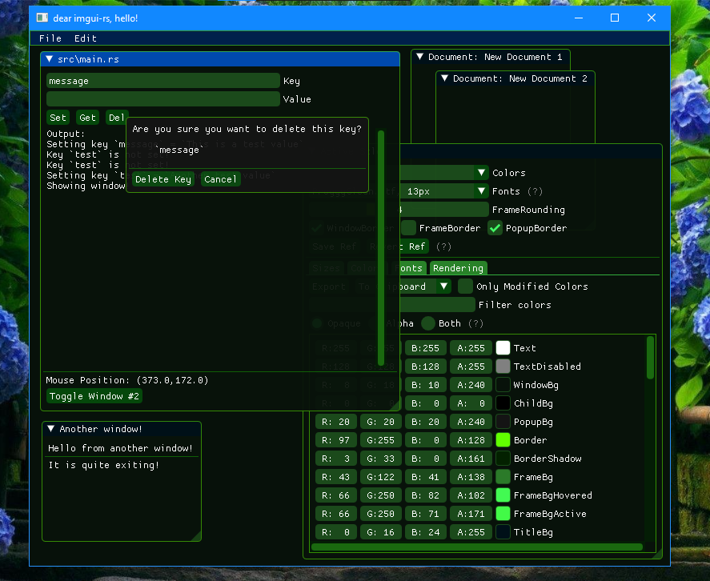

# Dear imgui-rs,
# hello.

This is a fairly basic, but complete and standalone example application for the Rust version of `dear imgui` (https://github.com/ocornut/imgui), imgui-rs (https://github.com/imgui-rs/imgui-rs/).

In contast to the monorepo examples provided with `imgui-rs`, all dependencies in this template are fetched from `crates.io` to help ensure a reproducible project setup and ease initial use for developers new to the crate.

For many more examples of `imgui-rs` API usage, see the main repo's imgui-examples crate corresponding to this repo's `imgui-rs` version, which should all work with this template (https://github.com/imgui-rs/imgui-rs/tree/v0.8.2/imgui-examples/examples).

## Screenshot

*The `Blue Hydrangea` theme that comes with this example.*

## Using it

To use this template, please click the `Use this template` button at the top of the GitHub project page to create a new repo.

You will need a Rust compiler (naturally) as well as a configured C++ compiler in order to build the C++ `imgui` backend. Assuming you have both of these configured and in your path, you should only need to run the app to see it working:

    cargo run

Please let me know if you have any problems!

## Structure

This borrows the boilerplate `support` module from `imgui-rs/imgui-examples`, with minor modifications to make it a bit easier to change the OS window size and background color when calling `support::init()`.

* `Dialogs/Forms & Popups`: The application itself in `main.rs` shows support for a "main window" (essentially the dialog interaction model common in many utilities), with a non-persistent State struct to store the application's data in memory. This window also uses a `popup` as a confirmation mechanism.

* `Document/View`: There also is the beginning of a very basic Document/View setup with multiple "document" windows (File > New).

* `Styles`: Finally, you can trigger the `imgui` default style editor window to modify the style as desired. To permanently apply the style, click `Export` in the style editor with `Only modifed colors` unchecked. This will put the C++ code for the theme onto your system clipboard, which you can paste and modify to match the syntax in `main.rs`.

* The `imgui-rs` example main menu bar is included as a reference for how to create complex menus. On the File menu the `New` command will create a "document", and `Toggle Style Editor` will show the built-in `imgui` style editor window.

## Renderer and Support Modules

This example only works with `imgui-glium-renderer` and `imgui-winit-support`. Other renderers and support modules are not currently planned to be added but contributions in the form of PRs are accepted.
